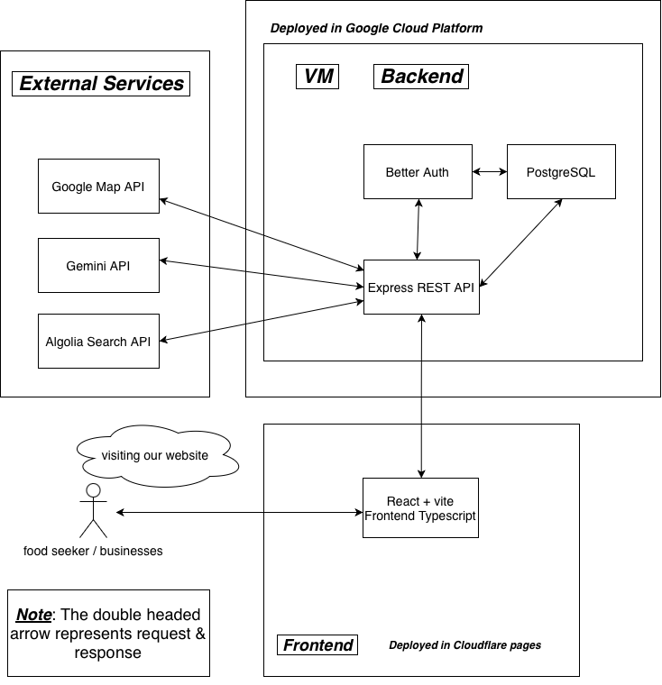
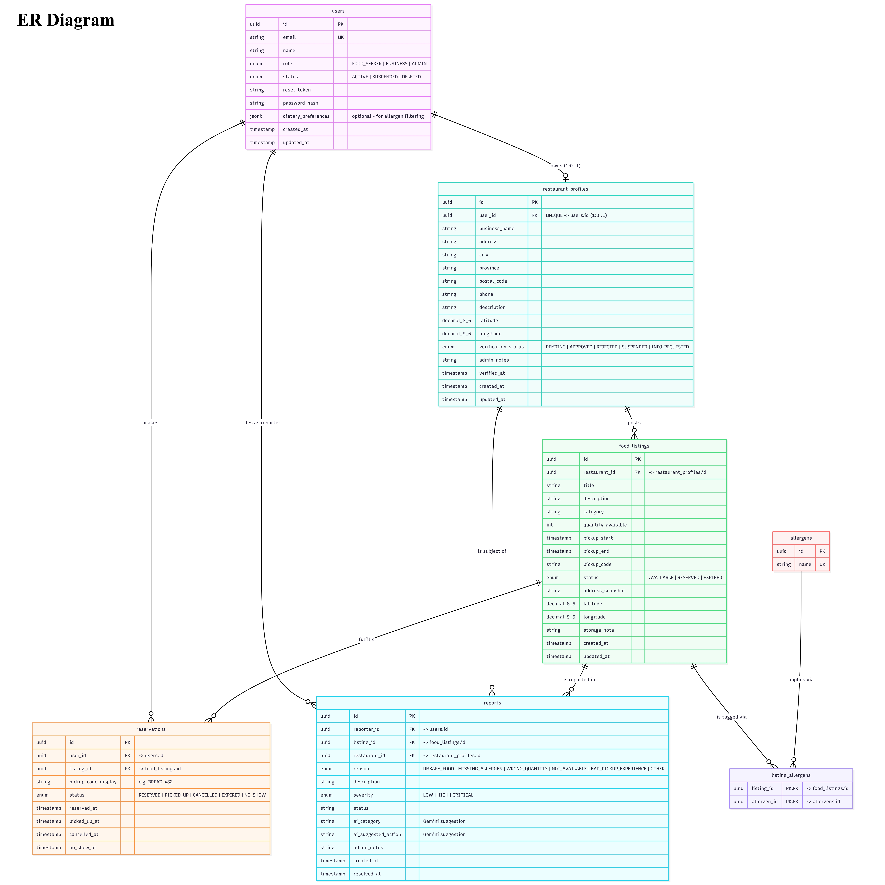

# ResQPlate 
The name of our application is ResQPlate. It is a food donation platform that helps restaurants, cafes, bakeries and food businesses distribute leftover edible food with people in need.  

## Problem Statement 
Food insecurity and food waste are both serious problems nowadays; many people struggle to get affordable meals, while restaurants, bakeries and cafes often throw leftover edible food at the end of the day. Today, this problem is partly solved through food banks and donations programs. Apps such as Too Good To Go help businesses sell leftover food at discounted prices. However, discounted food may not help people who cannot afford to pay. Our app solves this problem by creating a donation-based dynamic platform where verified food businesses can post leftover food for free, and food seekers can find and receive available food nearby. This will help reduce food waste while making extra food accessible to people who need it.  

## Target Audience 
The app mainly targets Food seekers, which comprises anyone who cannot afford a basic meal, and Food Businesses comprises any big or small shops like bakeries, cafes, and restaurants that can give food is our target audience. Instead of relying on food banks, food seekers benefit from being able to find free leftover food nearby and pick it up more conveniently. Donating surplus edible food rather than throwing it away benefits businesses in reducing waste, community support and organized handling of leftover food. 

## Scope/Features 
1. Business Profile & Verification: Businesses like the restaurants/bakeries create a business profile. Then admin reviews, approve/ reject, or request more information from business before allowing them to post food listing on the app dashboard. 

2. Food Listing Creation: Verified businesses create, edit, publish, manage listing quantity, cancel, pickup time, location, and allergens for Food Seekers. 

3. Food search and reservation for food seekers: Food seekers can create accounts and search for available listings near them, filter listings, reserve pickup time, and receive pickup code to confirm pickup and claim their food.  

4. Pickup Management: Businesses customize and manage reservations for their listing, can confirm pickup using codes, can mark no-show, and can update reservation status.  

5. AI-Assisted Admin Report (if times permits): Admins can review safety reports submitted by food seekers, and then AI suggests report category, severity, and possible actions for admin like hiding the listing, request response from businesses who posted listing. And generate a reports summary to understand patterns for business analytics.  
 
## Architecture 

The app will use separate frontend, backend, and database architecture on the Google Cloud platform and Cloudflare. The frontend is a React + Vite Typescript app deployed on Cloudflare pages, which is responsible for handling routing by serving frontend for normal page requests and forwarding `/api` requests to backend VM. The backend will be an Express REST API deployed on a VM on GCP. It will handle application logic, authentication through Better Auth, RBAC, food listing management, reservations, reports and communication with external services: the Google Maps API for location and map-based listings, the Gemini API for AI-assisted report review, and the Algolia Search API for faster listing search and filtering. The database will be PostgreSQL hosted inside our Backend VM and will be managed by us, which stores all the data of our application, and it will act as an internal database service. At a high-level, users will access the frontend Cloudflare page in their browser, or mobile app, then frontend sends API requests to backend VM. Backend reads and writes data in PostgreSQL and calls external APIs when needed, and the responses are sent back to frontend and displayed for food seekers and businesses.  

## Justification for Stack A 

We will be using Stack A: Express + React for our application because our app is strongly API-driven and it's also backend heavy. It includes authentication, role-based authorization, restaurant verification, food listing management, reports, and admin moderations.  

1. We chose two apps over one because our Backend API is a major part of the project. Having a separate express backend makes it easier to organize, test, and document. A separate backend gives us more flexibility in our project. Our app workflow requires protected admin routes, business listing routes, reservation transaction logic, and many more which are easier to manage through dedicated Express backend.
   
2. We will be using one GitHub repository with two independent npm applications: frontend and backend. The frontend and backend will have their own package.json file, dependencies, and environmental variables. This will help us keep deployment simple because frontend and backend will be deployed separately.
   
3. The frontend and backend will be deployed separately. Our frontend will be deployed on Cloudflare page. The Express backend will run on the VM in GCP as a REST API. Our frontend will call backend routes `/api` requests to backend VM, so frontend will use relative API paths and avoid most CORS issues. We will not serve the React bundle from Express because frontend and backend are deployed separately. If direct cross-origin calls are needed, Express will use CORS configured only for frontend page origin.
   
4. Our API style will be REST, because the app is built around different resources such as food seekers, business profiles, food listings, reservations, and reports. 
 

## Team Responsibilities and Feature Mapping 
Our team is suitable for this app because it can be divided into clear features, and each member will take ownership of one major feature while still doing integration and testing. 

Luvver Singh Lamba: Food search and reservation for food seekers. 
Priyansh Sarvaiya: Business Profile & Verification.  
Daiwik Marrott: Food Listing Creation. 
Sukhjit Singh Chana: Pickup Management. 
 

## ER Diagram 

The Main entities are Users, Restaurant Profiles, Food Listings, Reservations, Reports, Allergens, and Listing Allergens. The key relationships are: 

1. One user can own a zero or one restaurant profile. (1-0..1 relationship)
   
2. One restaurant profile can create many food listings. (1-N relationship) 

3. One user can make many food reservations. (1-N relationship) 

4. Food listings and allergens have many-to-many relationships through listing_allgergens table. (N-M relationship)  

