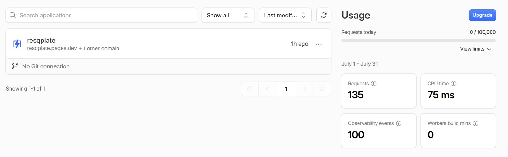
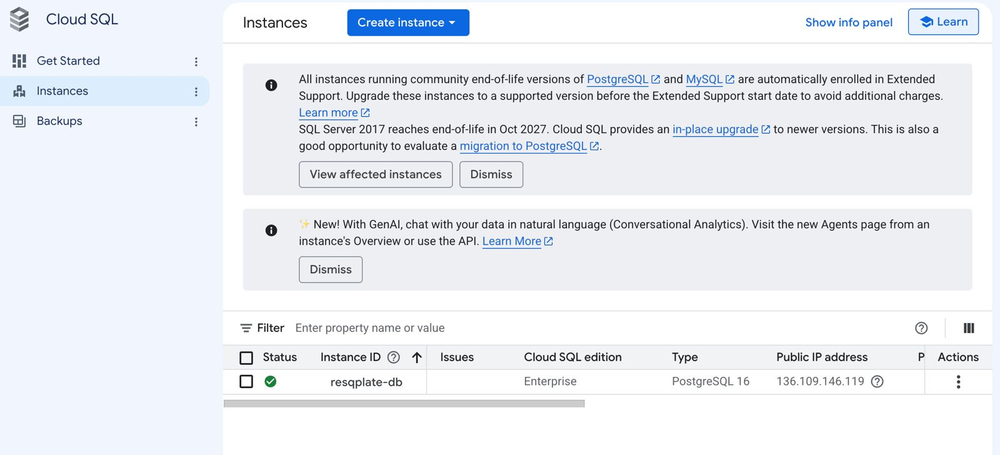
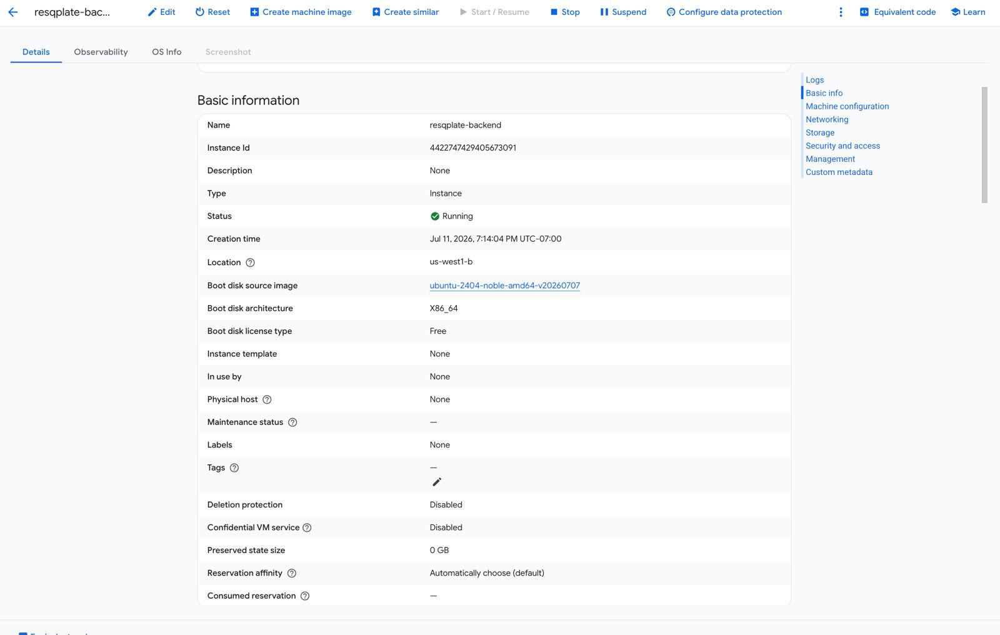
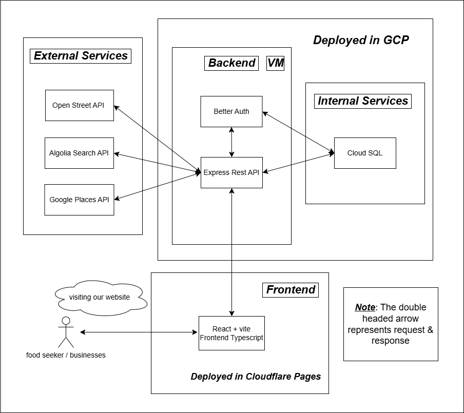
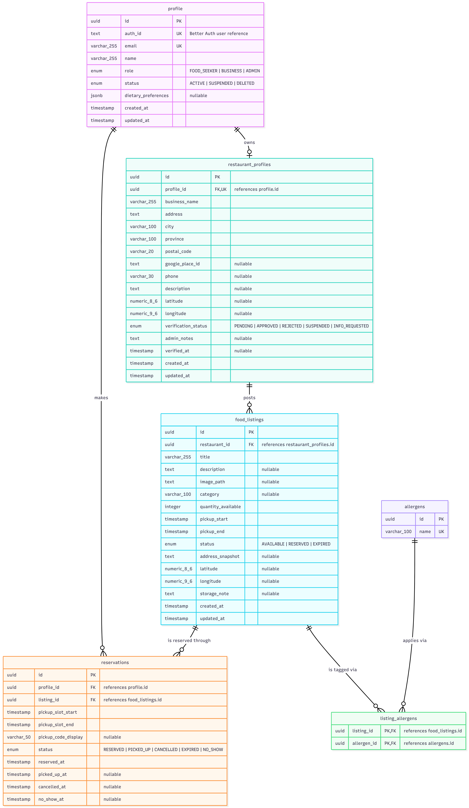

# ResQPlate

ResQPlate is a food donation platform for restaurants, cafes, bakeries, and other food businesses to give away leftover edible food instead of throwing it out.

## Problem statement

Food insecurity and food waste are both serious problems, and they're related. Many people struggle to afford meals while restaurants, bakeries, and cafes throw out edible food at closing time. Food banks and donation programs help, and apps like Too Good To Go let businesses sell leftover food at a discount, but a discount still doesn't help someone who can't pay at all. ResQPlate is donation-based instead: verified food businesses post leftover food for free, and food seekers find and reserve it nearby.

## Tech stack

| Layer | Technologies |
|---|---|
| Frontend | React 19, TypeScript, Vite, React Router, Leaflet (maps), Algolia InstantSearch |
| Backend | Node.js, Express 5, TypeScript, Drizzle ORM, PostgreSQL, better-auth, Resend (email), Sharp (image processing), Swagger |
| Infra / DevOps | Docker Compose, GitHub Actions (CI, deploys, DB migrations), GCP (Cloud SQL, Compute Engine, Secret Manager), Cloudflare Pages + Workers, Caddy |

## Features

1. Business profile & verification. Restaurants, bakeries, cafes, and other businesses create an account and complete a profile with Google Places address autocomplete. Admins review businesses, approve or reject them, request more information, suspend accounts, and leave notes.
2. Food listing creation. Verified businesses create, edit, and view food listings, including quantity, images, pickup time, location, and allergens, and can cancel listings.
3. Food search & reservation. Food seekers search nearby listings through Algolia, filter by city, category, allergens, and distance, reserve a one-hour pickup slot, and get a pickup code to confirm pickup. They can view or cancel eligible reservations too.
4. Pickup management. Businesses view and manage reservations, confirm pickups by code, mark no-shows, update reservation status, and search by food seeker email.

## Screenshots

Production infrastructure: Cloudflare Pages, Cloud SQL, and the backend VM on GCP.

<p>
  
  
  
</p>

More in [`/screenshots`](/screenshots/).

## Architecture



## ER diagram



## Local setup

See the [Local Setup Guide](docs/setup.md) for prerequisites, environment variables, database configuration, and instructions to run the app locally.

```bash
npm install
npm run db:start      # start local Postgres via Docker Compose
npm run db:migrate
npm run dev            # runs backend + frontend (see docs/setup.md for details)
```

## Testing & code quality

- Backend: unit and integration tests through Node's built-in test runner (`npm test`), with coverage reporting (`npm run test:coverage`)
- ESLint and Prettier run through Husky pre-commit and pre-push hooks
- CI runs lint, build, and tests on every PR through GitHub Actions

## My contributions

This was a team project, built by a group of four for our software engineering course. I focused mainly on infrastructure, authentication, and backend work:

- Set up the monorepo workspace (frontend, backend, shared packages) and the GitHub Actions pipelines for linting, testing, and deployment
- Built and deployed the production infrastructure: a GCP Compute Engine VM plus Cloud SQL, a Cloudflare Pages and Workers proxy, Caddy for HTTPS, and GCP Secret Manager for CI secrets
- Built authentication end to end with better-auth: signup, login, logout, forgot/reset password (using Resend for the emails), and role-based route guards for seeker, business, and admin users
- Designed the database schema in Drizzle ORM/PostgreSQL, including the better-auth tables and the restaurant, listing, and reservation models, and revised it as requirements changed
- Built the dashboards and routing for the seeker, business, and admin roles
- Wrote the pickup time-slot logic, so a pickup code only works during the reserved window
- Added local image storage with server-side resizing so the frontend loads faster
- Wrote the backend service/repository test suites and wired coverage into CI
- Wrote the Swagger docs for the restaurant module, plus the architecture and ER diagrams

## Contributors

Built by a team of four as a course capstone project.
